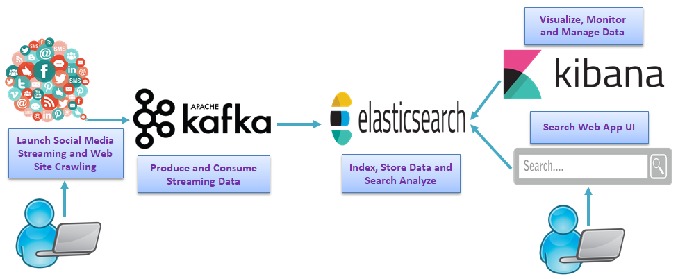
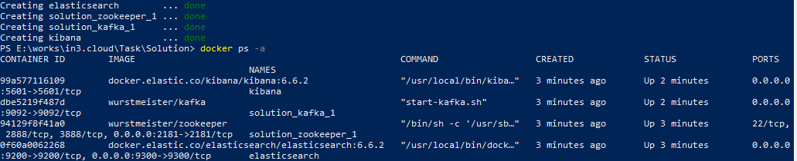
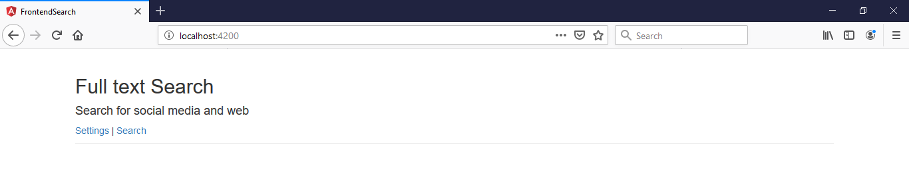
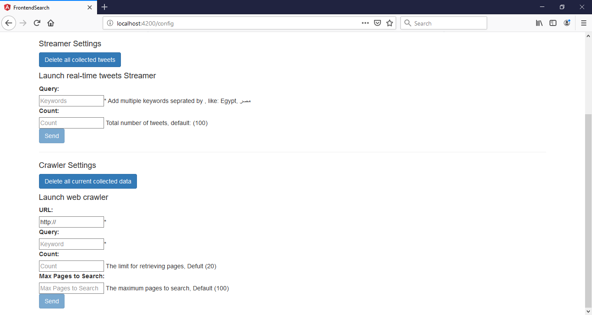
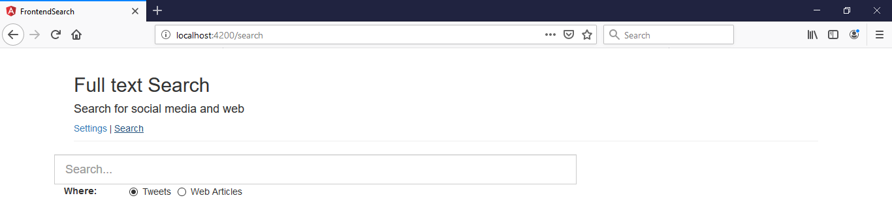

# Full-Text Search System to stream, collect, clean, store and filter data collected from different sources using Docker, Kafka, Elasticsearch, Kibana, Java, Spring Boot, Spring Kafka, Spring Data Elasticsearch, Twitter HBC, Jsoup and Angular

Designing and implementing a system to stream, capture, clean, store data, and allows users to make full-text search and filter data collected from different sources (social media, world wide web). It has the following services:

	+ **Producer service** to extract data from different sources (social media and web), clean, send it to Kafka producer and provide APIs to configure and launch the streaming for social media (twitter) and Crawling the web sites using Java, Spring Boot, Spring Kafka and Maven.

	+ **Consumer service** is a Kafka Consumer to read messages from Kafka, process and index them into Elasticsearch and provide APIs for full-text searching and filtering data from Elasticsearch using Java, Spring Boot, Spring Kafka, Spring Data Elasticsearch and Maven.

	+ **FrontEnd app** is a simple UI application using Angular to configure and launch the real-time social media (twitter) streamer and web crawler. It also provide full-text search on the collected data in a simple way.

## Table of contents
* [Architecture](#architecture)
* [Technologies](#technologies)
* [Getting Started](#getting-started)
* [About me](#about-me)
* [Acknowledgments](#acknowledgments)

## Architecture
The  next diagram shows the system architecture



	+ Tha admin of the system *configure and launch* the real-time social media streaming (Twitter for this case study)  and web crawling for any other web site using simple UI app. The streaming data send to *Kafka produce*.
	+ The *Kafka consumer* consumes data and the consumer service converting it to *Elasticsearch*.
	+ The *Elasticsearch* receives data from Kafka to index and store it.
	+ Tha admin can use *Kibana* to visualize, monitor and manage data.
	+ The user can use a simple *UI search* app to make *full-text search* and filter the collected data.

## Technologies
This project is created using the following technologies:

1. Java 8
2. Maven Dependency Management	
3. Spring Boot:
	
	+ Spring Web
	+ Spring Kafka
	+ Spring Data Elasticsearch
	+ Spring Actuator

4. Twitter hbc
5. Jsoup
6. Docker
7. Apache Kafka and Apache Zookeeper (required for Kafka)
8. Elasticsearch
9. Kibana
10. Angular

## Getting Started

These instructions will get you a copy of the project up and running on your local machine for development and testing purposes. 

### Prerequisites
You need to install the following software:
 * Java JDK 1.8+
 * Maven 3.0+
 * Git client
 * Docker Compose: To [install docker-compose](https://docs.docker.com/compose/install/)
 * Twitter API credentials: Set up an Twitter application account and get Twitter app credentials from [https://apps.twitter.com/](https://apps.twitter.com/). 
 	For help: [How to create a Twitter application account](http://docs.inboundnow.com/guide/create-twitter-application/)
 * Angular 6+ 

### Setup
To run this project, install it locally as follow:

1. **Clone the application**

	```bash
	git clone https://github.com/SayedBaladoh/Full-Text-Search-using-Docker-Kafka-Elasticsearch-Kibana-Java-Spring-Boot-HBC-Jsoup-Angular.git
	```

2. **Change twitter configuration with your API Key, API Secret Key, Access Token and  Access Token Secret**

	+ open `producer/src/main/resources/application.yml` file
	+ change twitter `auth` properties:
	```bash
	social:
	  twitter:
	    auth:
	      apiKey: API_KEY
	      apiSecretKey: API_SECRET_KEY
	      accessToken: ACCESS_TOKEN
	      accessTokenSecret: ACCESS_TOKEN_SECRET
	```

3. **Start the Kafka, Zookeper, Elasticsearch and Kibana using docker-compose**

	The project includes a [*docker-compose.yml*](docker-compose.yml)  file so you can use Docker Compose to start up them, no installation needed.

	```bash
	cd solution_directory
	docker-compose up -d
	```
	
4. **Check if Kafka, Zookeper, Elasticsearch and Kibana is running**

	From command prompt:

	```bash
	docker ps -a
	```
	You should see the following result:
	
	
	You can even make other checks in order to make sure your Kibana and elasticsearch are running. Open your internet browser and use the following URLs:

	+ http://localhost:9200/ (elasticsearch)
	+ http://localhost:5601/ (Kibana)
	
5. **Run Producer service application**

	You can start the producer service by typing the following command

	```bash
	cd producer
	mvn spring-boot:run
	```
	The producer service will start on port `8081`, So you'll be able to visit it under address `http://localhost:8081`.
	
	+ To view `info` about `producer` service `http://localhost:8081/producer/actuator/info`
	
	+ To `Check Health` for `producer` service `http://localhost:8081/producer/actuator/health`

6. **Run the Consumer service application**

	You can start the consumer service by typing the following command

	```bash
	cd consumer
	mvn spring-boot:run
	```
	
	The consumer service will start on port `8082`, So you'll be able to visit it under address `http://localhost:8082`. 

	+ To view `info` about `consumer` service `http://localhost:8082/consumer/actuator/info`
	
	+ To `Check Health` for `producer` service `http://localhost:8082/consumer/actuator/health`
			
7. **Start the Frontend application**

	You can start the UI application by typing the following commands

	```bash
	cd front-end
	npm install
	ng serve
	```
	
	The UI app will start on port `4200` by default, So once you have successfully started application you'll be able to visit it using `http://localhost:4200`.

8. **Package the applications**

	You can also package the applications in the form of a `jar` file and then run each application like so

	```bash
	cd service_directory
	mvn clean package
	java -jar target/service_name-0.0.1-SNAPSHOT.jar
	```
	
	+ *service_directory*: the directory of the service.
	+ *service_name*: the name of the service.

### Running

* **Full-Text Search Front-end application**

To access the frontend application use the following endpoin

	`http://localhost:4200`
	
	
	
	Now take a look on UI app: You will find two links (Settings | Search). 
		
* **Full-Text Search Front-end Settings Tab**
		
	Use *Settings* to configure and launch the real-time social media (twitter) streaming and web crawling to collect your required data.
	
	+ `http://localhost:4200/config`
		
	
	 
* **Full-Text Search Front-end Search Tab**

	 The *Search* link provide full-text search on the collected data.
	 
	 + `http://localhost:4200/search`

		 
	 
## References

* [Social media analytics: a survey of techniques, tools and platforms](https://link.springer.com/article/10.1007/s00146-014-0549-4)
* [How to effectively clean social media data for analysis](https://hub.packtpub.com/clean-social-media-data-analysis-python/)
* [8 Most Popular Java Web Crawling & Scraping Libraries](https://www.datasciencecentral.com/profiles/blogs/8-most-popular-java-web-crawling-amp-scraping-libraries)
* [Web Crawling: How can you extract news articles given keywords and news sources?](https://www.quora.com/Web-Crawling-How-can-you-extract-news-articles-given-keywords-and-news-sources)
* [How to make a simple web crawler in Java](http://www.netinstructions.com/how-to-make-a-simple-web-crawler-in-java/)
* [Get started with the Twitter developer platform](https://developer.twitter.com/en/docs/basics/getting-started)
* [Streaming Real-time Twitter feeds using Apache Kafka](https://www.linkedin.com/pulse/streaming-real-time-twitter-feeds-using-apache-kafka-manisha-malhotra/)
* [Write a Kafka Producer Using Twitter Stream](https://dzone.com/articles/how-to-write-a-kafka-producer-using-twitter-stream)
* [Building a Full-Text Search App Using Docker and Elasticsearch](https://blog.patricktriest.com/text-search-docker-elasticsearch/)
* [Elasticsearch with Spring Boot] (https://piotrminkowski.wordpress.com/2019/03/29/elasticsearch-with-spring-boot/)

## About me

I am Sayed Baladoh - Phd. Senior Software Engineer. I like software development. You can contact me via:

* [LinkedIn+](https://www.linkedin.com/in/sayed-baladoh-227aa66b/)
* [Mail](mailto:sayedbaladoh@yahoo.com)
* [Phone +20 1004337924](tel:+201004337924)

_**Any improvement or comment about the project is always welcome! As well as others shared their code publicly I want to share mine! Thanks!**_

## Acknowledgments

Thanks for reading.

Did I help you?
+ Share it with someone you think it might be helpful.
+ Give a star to this project
